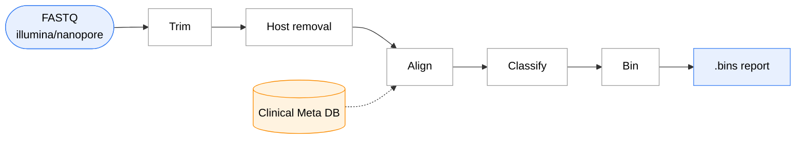

# mIHoP


 [](https://pypi.org/project/snakemake)


*Accurate detection of pathogens from low biomass samples.*

## Introduction

mIHoP is a [Snakemake](https://snakemake.github.io/) workflow wrapped as a CLI using [Snk-CLI](https://github.com/Whytamma/snk-cli). It trims reads, removes human host reads, aligns against the pre-built [clinical meta db](https://github.com/mjsull/clinical_meta_db_download), and reports the pathogen species ranked by genome coverage.


---

## Quick Start

```bash
git clone xxxx
cd xxx
python -m venv venv
source venv/bin/activate

pip install -e .
mihop pull-db DB_DIR # TODO: download clinical metadb to local from s3
mihop prepare FASTQS_DIR -o samples.csv  ## this will generate a samples.csv from a folder with fastqs
mihop config ## check the default configuration and change if needed > config.custom.yaml
mihop run --samples samples.csv --config config.custom.yaml --cores 20
```

## Installation

mIHop can be installed via pip or conda

```bash
conda create -n mihop -c conda-forge -c bioconda mihop
```

## Usages

- Subcommands

```zsh
 mihop --help

 Usage: mihop [OPTIONS] COMMAND [ARGS]...

         ___  _  _       ___
  _ __  |_ _|| || | ___ | _ \
 | '  \  | | | __ |/ _ \|  _/
 |_|_|_||___||_||_|\___/|_|

 Accurate detection of pathogens from low biomass samples

╭─ Options ────────────────────────────────────────────────────────────────────────────────────────────╮
│ --version  -v        Show the workflow version and exit.                                             │
│ --path     -p        Show the workflow path and exit.                                                │
│ --help     -h        Show this message and exit.                                                     │
╰──────────────────────────────────────────────────────────────────────────────────────────────────────╯
╭─ Commands ───────────────────────────────────────────────────────────────────────────────────────────╮
│ info     Show information about the workflow.                                                        │
│ run      Run the workflow.                                                                           │
│ config   Show the workflow configuration.                                                            │
│ metadb   Download clinical meta DB from s3                                                           │
│ prepare  Generate a samplesheet from FASTQ files found in `fastq_dir`.                               │
│ env      Access the workflow conda environments.                                                     │
│ script   Access the workflow scripts.                                                                │
│ profile  Access the workflow profiles.                                                               │
╰──────────────────────────────────────────────────────────────────────────────────────────────────────╯
```

- Run snakemake pipeline

The parameters in configuration yaml file can be specified in CLI.

```zsh
 Usage: mihop run [OPTIONS]

 Run the workflow.

 All unrecognized arguments are passed onto Snakemake.

╭─ Options ────────────────────────────────────────────────────────────────────────────────────────────╮
│ --config                   FILE     Path to snakemake config file. Overrides existing workflow       │
│                                     configuration.                                                   │
│ --resource        -r       PATH     Additional resources to copy from workflow directory at run      │
│                                     time.                                                            │
│ --profile         -p       TEXT     Name of profile to use for configuring Snakemake.                │
│ --dry             -n                Do not execute anything, and display what would be done.         │
│ --lock            -l                Lock the working directory.                                      │
│ --dag             -d       PATH     Save directed acyclic graph to file. Must end in .pdf, .png or   │
│                                     .svg                                                             │
│ --cores           -c       INTEGER  Set the number of cores to use. If None will use all cores.      │
│ --no-conda                          Do not use conda environments.                                   │
│ --keep-resources                    Keep resources after pipeline completes.                         │
│ --keep-snakemake                    Keep .snakemake folder after pipeline completes.                 │
│ --verbose         -v                Run workflow in verbose mode.                                    │
│ --help-snakemake  -hs               Print the snakemake help and exit.                               │
│ --help            -h                Show this message and exit.                                      │
╰──────────────────────────────────────────────────────────────────────────────────────────────────────╯
╭─ Workflow Configuration ─────────────────────────────────────────────────────────────────────────────╮
│ --samples                       TEXT                                                                 │
│ --platform                      TEXT     [default: illumina]                                         │
│ --fastp-extra                   TEXT     [default: --cut_front --cut_tail --cut_window_size 4        │
│                                          --cut_mean_quality 20 --length_required 100                 │
│                                          --low_complexity_filter]                                    │
│ --fastplong-extra               TEXT     [default: --length_required 100 --low_complexity_filter]    │
│ --hostile-minimap2-index        TEXT     [default: /data/hostile/human-t2t-hla]                      │
│ --nohuman-db                    TEXT     [default: /data/databases/nohuman/db]                       │
│ --database-dir                  TEXT     [default: /data/databases/cmdd_fastas_dustmasked]           │
│ --n-database-files              INTEGER  [default: 400]                                              │
│ --taxonomy-file                 TEXT     [default: /data/databases/taxonomy.tsv]                     │
│ --minimap-extra                 TEXT     [default: -N 1000000]                                       │
│ --minimap-min-length            INTEGER  [default: 50]                                               │
│ --minimap-min-coverage          FLOAT    [default: 0.8]                                              │
│ --minimap-min-identity          FLOAT    [default: 0.9]                                              │
│ --bin-size                      INTEGER  [default: 500]                                              │
╰──────────────────────────────────────────────────────────────────────────────────────────────────────╯
```
